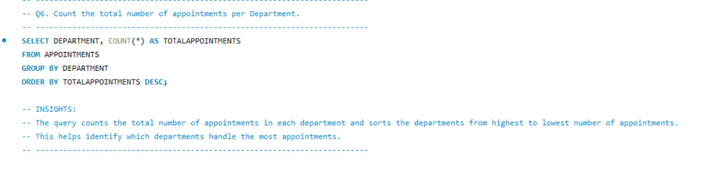
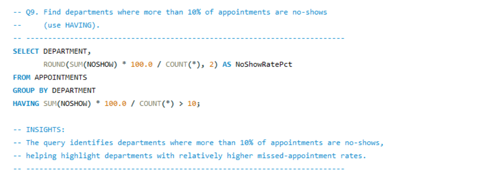
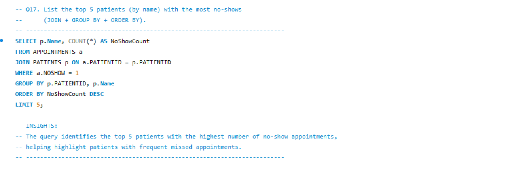
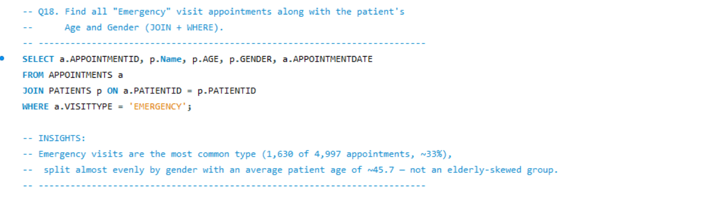
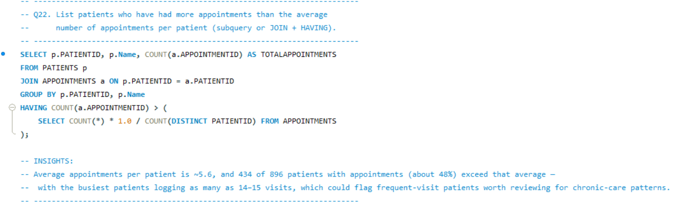

# Hospital Appointments SQL Project

A SQL practice project built on a cleaned hospital dataset with two related tables: **Patients** and **Appointments**.

## Dataset

- **Patients** (1,000 rows) — PatientID, Name, DOB, Gender, Insurance, DOB_Invalid, Age
- **Appointments** (4,997 rows) — AppointmentID, PatientID, DoctorID, ClinicID, ScheduledDate, AppointmentDate, LeadDays, Department, VisitType, NoShow, NoShow_Label

Linked via `Appointments.PatientID -> Patients.PatientID`.

## What was done

1. Cleaned the raw data: removed duplicate/colliding IDs, trimmed whitespace, standardized categorical values (e.g. Insurance), flagged invalid dates of birth, and added derived columns (Age, NoShow_Label).
2. Built a relational schema (`Hospital_Database.sql`) with `CREATE TABLE` statements, a foreign key constraint, and all data as `INSERT` statements.
3. Wrote 22 SQL practice questions (`Hospital_Admission_project.sql`) covering:
   - Basic SELECT / WHERE / ORDER BY
   - Aggregation (GROUP BY / HAVING)
   - CASE / conditional logic
   - Joins (INNER, LEFT)
   - Subqueries

## How to use

1. Run `Hospital_Database.sql` in your SQL client (MySQL, PostgreSQL, or SQLite) to create and populate the tables.
2. Open `Hospital_Admission_project.sql` and write/run each query under its question.

## Tools

SQL (tested against SQLite; minor syntax tweaks noted in comments for MySQL/PostgreSQL where date functions differ).

## Screenshots

Query results from a few of the key questions, run in the SQL client:

### Q6 — Total appointments per Department

### Q9 — Departments with a no-show rate above 10%

### Q17 — Top 5 patients with the most no-shows

### Q18 — Emergency visits with patient Age and Gender

### Q22 — Patients with more appointments than average

Project Submitted by: 

Name: Divyanshu Dave

